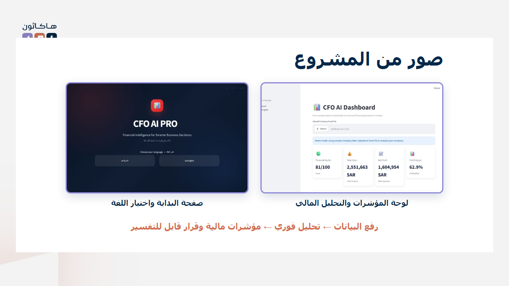

# CFO AI PRO

### Financial Intelligence for Smarter Business Decisions

[](https://www.python.org/)
[](https://dcv7wnj96dqkafa7rb2ukc.streamlit.app/)
[](https://github.com/shujanAL/CFO-AI-PRO)

**[Launch the live application](https://dcv7wnj96dqkafa7rb2ukc.streamlit.app/)** · **[Download the Excel template](templates/cfo_ai_template.xlsx)** · **[View the presentation](docs/CFO_AI_PRO_AMAD_2026_FINAL.pptx)**



## Overview

CFO AI PRO is a bilingual financial decision-support platform for small and medium enterprises. It transforms structured Excel data into financial health indicators, bank-financing readiness, forecasts, decision simulations, option rankings, and evidence-based executive recommendations.

Built by **Shujaan Almutairi — شجعان المطيري** for the **AMAD 2026 Hackathon**.

## نبذة عن المشروع

منصة ثنائية اللغة تساعد المنشآت الصغيرة والمتوسطة على تحويل بياناتها المالية من Excel إلى مؤشرات واضحة، وتقييم للجاهزية التمويلية، وتوقعات مالية، ومحاكاة للقرارات قبل تنفيذها. تجمع المنصة رحلة التحليل المالي كاملة في مكان واحد مع توصيات قابلة للتفسير.

## The Problem

SMEs often spend significant time analyzing financial data while financing-readiness assessment, forecasting, and decision simulation remain manual or scattered across separate tools.

**CFO AI PRO unifies this workflow in one explainable platform.**

## Project Journey

`Upload Excel` → `Validate & Clean Data` → `Financial Analysis` → `Health & Financing Scores` → `Forecast` → `Decision Simulator` → `Executive Recommendation`

## Key Features

- Excel upload with structural validation
- Arabic and English experience
- Executive financial dashboard
- Financial Health Score
- Bank Financing Readiness Score and indicative limit
- Sales, expense, and cash-flow forecasting
- Financial risk and collection insights
- Decision simulator with scenario comparison
- AI-assisted decision ranking
- Evidence-based executive recommendation
- Downloadable executive PDF report
- Built-in demo mode for instant evaluation

## Quick Demo

1. Open the **[live application](https://dcv7wnj96dqkafa7rb2ukc.streamlit.app/)**.
2. Choose Arabic or English.
3. Explore the dashboard immediately using the included demo data.
4. To analyze another company, download [`cfo_ai_template.xlsx`](templates/cfo_ai_template.xlsx), replace the sample values, and upload it from the dashboard.

> The current prototype accepts `.xlsx` files that follow the supplied template. This validation protects the analysis from missing or incorrectly mapped financial fields.

## Required Excel Structure

| Sheet | Required columns |
|---|---|
| `Company` | Company Name, Industry, City, Employees, Start Date |
| `Sales` | Date, Customer, Category, Amount, Payment Method |
| `Expenses` | Date, Category, Amount, Description |
| `Invoices` | Customer, Issue Date, Due Date, Amount, Status |
| `Employees` | Department, Salary, Hire Date |

## What Makes It Different?

- Combines financial analysis and decision support in one platform
- Evaluates bank-financing readiness
- Simulates decisions before implementation
- Ranks alternatives using return, health, risk, and confidence
- Explains the evidence and assumptions behind its recommendation

## Technology Stack

Python · Streamlit · Pandas · NumPy · Plotly · Scikit-learn · SQLite · OpenPyXL · ReportLab

## Run Locally

```bash
git clone https://github.com/shujanAL/CFO-AI-PRO.git
cd CFO-AI-PRO
python -m venv .venv
```

Windows PowerShell:

```powershell
.venv\Scripts\Activate.ps1
pip install -r requirements.txt
streamlit run app.py
```

Open `http://localhost:8501`.

## Project Structure

```text
CFO-AI-PRO/
├── app.py                  # Language selection and landing page
├── pages/                  # Main financial dashboard
├── engines/                # Metrics, forecasts, scoring and decisions
├── components/             # Dashboard UI components
├── utils/                  # Excel validation and data preparation
├── report/                 # Executive PDF generation
├── templates/              # Ready-to-use Excel templates
├── tests/                  # Core calculation checks
└── docs/                   # Presentation and project visuals
```

## Privacy & Limitations

- Uploaded data is used to produce the current analysis and is not committed to this repository.
- The public deployment is a hackathon prototype; do not upload confidential production banking data.
- Recommendations are scenario-based estimates, not guaranteed outcomes.
- Results do not replace professional accounting, banking, investment, or legal advice.

## Roadmap

- Secure company accounts and isolated storage
- Flexible column mapping for different Excel formats
- ERP and accounting-system integrations
- Multi-company portfolio analysis
- Conversational financial assistant
- Expanded forecasting and stress testing

## Author

**Shujaan Almutairi — شجعان المطيري**  
AMAD 2026 Hackathon
